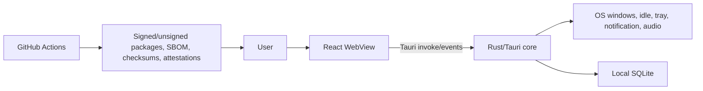

# Architecture Overview

`RTK.md` is the current implementation truth. OpenSpec is normative behavior; these pages explain boundaries; ADRs record durable decisions; READMEs are entry points.

The frontend owns presentation and transient UI state. Rust owns privileged OS access, monitoring, classification, persistence, and native effects. No application server exists. The release system is separate from runtime and receives secrets only through protected environments.

## Capability Map

| Capability | Frontend entry | Command/service | Storage/events | Tests/spec |
|---|---|---|---|---|
| Sessions/recovery | `Dashboard`, `useFocusSession` | session commands, `SessionLogger`, monitor | `sessions`, `session_runtime`, `session:tick` | hook/store/Rust tests; `focus-sessions`, `session-recovery` |
| Focus rules | `Settings` | settings commands, `RuleEngine` | settings, timeline events | rule-engine tests; `focus-rules` |
| Alerts/breaks | `Overlay`, alert components | notification/audio/monitor commands | `alert:*`, `break:*` | overlay/Rust tests; alert/break specs |
| Shortcuts | `Settings`, `AppShell` | global-shortcut setup | settings, native registrations | settings tests; shortcut spec |
| History/export | `History` | session commands/logger | sessions/events/checkpoints | formatter/session tests; history spec |
| Settings/privacy | `Settings`, permissions modal | settings/permissions/audio commands | settings and recent audio | hook tests; settings/privacy specs |
| Release updates | future About/Settings surface | future bounded GitHub check | no telemetry/history | `release-update-check` |

See [frontend](frontend.md), [backend](backend.md), [database](database.md), [monitoring](monitoring.md), and [release](release.md).
